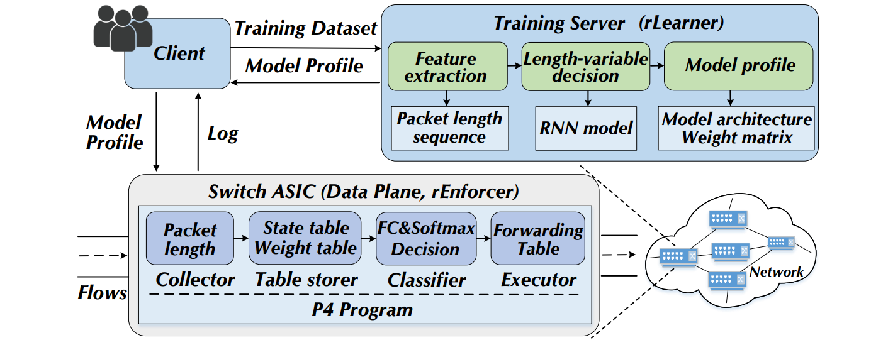
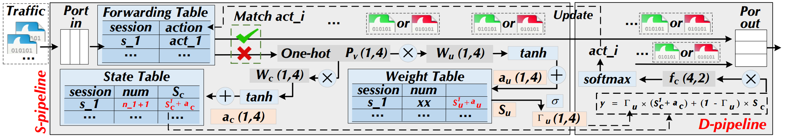
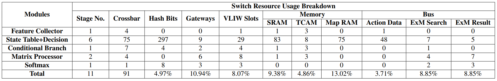

### RIDS: Towards Real-Time Intrusion Detections via RNN Model and Programmable Switches Co-designed Approaches



## Introduction

RIDS is a hardware-friendly Recurrent Neural Network (RNN) model that is co-designed with programmable switches. It includes: (i) rLearner focuses on implementing the model inference process which only depends on bitwise operations or integer additions/subtractions; (ii) rEnforcer is the specially designed pipeline enforcing rLearner-generated models inside the switches. This anonymous repository displays the corresponding source code for model implementation. 

## Requirements

```bash
pip install scipy
pip install numpy
pip install pandas
pip install tqdm
pip install pyecharts
pip install joblib
pip install pickle
pip install torch
```

Hardware:
- 40 GbE NIC: [DPDK-supported hardwares](https://core.dpdk.org/supported/)
  - e.g., Intel XL710-QDA2
- Tofino switch [Tofino](https://www.intel.com/content/www/us/en/products/network-io/programmable-ethernet-switch/tofino-series.html).

Software:
- Ubuntu 20.04.1 LTS
- Python 3.7
- [DPDK 20.11](http://git.dpdk.org/dpdk-stable/tag/?h=v20.11)
- MoonGen/Pktgen

## Packet Generator

- Install DPDK 20.11 following [Getting Started Guide for Linux](https://doc.dpdk.org/guides-20.11/linux_gsg/index.html).
- Compile DPDK applications.
- For the packet generator, can reference [MoonGen](https://github.com/emmericp/MoonGen/tree/master).


## Pipeline



## Programmable Switches

The P4 implementation is stored in ./rEnforcer/. 



## Model Architecture

The codes for the model construction are stored in ./rLearner/ folder. 
Among them, there are a series of binarization operations, such as activation functions, linear layers, etc. 


## Hyperparameter Setting

| Parameter | Setting | Description |
| ---- | ---- | ---- |
| max_seq_dim | 128 | The maximum time step of GRU. |
| input_dim | 4 | The input dimension. |
| hidden_dim | 4 | The hidden layer dimension. |
| learning_rate | 0.001 | The learning rate. |
| batch_size | 64 | The number of samples per batch. |
| num_epochs | 100 | The number of epochs. |

## Baselines

For baseline models, Mousika and Kitsune are stored in ./baseline/ folder. 

### References
- [Mousika: Enable General In-Network Intelligence in Programmable Switches by Knowledge Distillation](https://ieeexplore.ieee.org/document/9796936/), Guorui Xie, Qing Li, Yutao Dong, Guanglin Duan, Yong Jiang, Jingpu Duan - INFOCOM 2022
- [Kitsune: An Ensemble of Autoencoders for Online Network Intrusion Detection](https://arxiv.org/abs/1802.09089), Yisroel Mirsky, Tomer Doitshman, Yuval Elovici, and Asaf Shabtai - NDSS 2018
